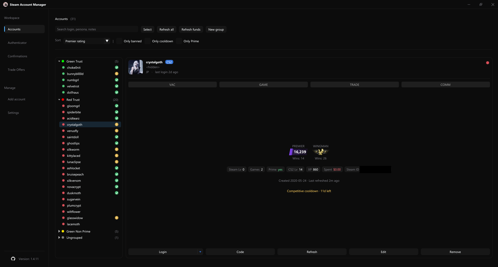

<div align="center">

# Steam Account Manager

[](https://github.com/luminary-cloud/steam-account-manager/actions/workflows/build.yml)
[](../../releases)
[](LICENSE)


A native Windows manager for your Steam accounts: encrypted vaults, Steam Guard
codes, mobile confirmations, trade offers, CS2 tools, and one-click login.

<details>
<summary><b>Show screenshot</b></summary>
<br>

</details>

Keep your accounts in one or more local vaults encrypted with your master password.
No installer, no telemetry, nothing leaves your machine.

</div>

## Features

### Vaults
- Keep separate sets of accounts in independent encrypted vaults (personal, trading, clients).
- Give each vault a name, a color, and a custom image icon.
- A picker on startup lets you choose a vault, or set one to open automatically.
- Switch vaults from the sidebar. Settings are shared across every vault; only the accounts differ.

### Accounts
- Card grid, or a two-pane list view with collapsible, color-coded groups.
- Add manually, from a `.maFile` or `info.dat`, by walking the full mobile login, or
  by pasting an NFA refresh token. Drag and drop files or folders onto the window.
- Per-account password, notes, color tags, and trust labels (green / yellow / red).
- Search, sort, multi-select, and bulk actions.
- Privacy mode hides every login until you click to reveal one.
- NFA (token-only) accounts: import a JWT refresh token, track when it expires, get
  flagged when it goes stale, edit or replace it later, and sign in without a password.

### Authenticator
- Steam Guard codes for any imported authenticator, with a next-code preview.
- Add Steam Guard in-app through the mobile flow, or remove it with your revocation code.
- Optional global hotkey copies the selected account's code without focusing the app.
- Hide-until-click and auto-copy-on-select options, with clipboard auto-clear.

### Confirmations
- List, approve, or deny mobile confirmations (trades, market listings, phone changes,
  gift redemptions), per account or in bulk.
- Optional background poller refreshes on a timer and toasts when new items arrive.
- Auto-approve rules for market listings, phone changes, and trades to a trusted-partner list.
- Every decision is written to a local audit log.

### Trade offers
- View, accept, or decline incoming and outgoing offers, with full item and escrow detail.
- Build and send offers from your inventory to a trade URL, with optional auto-confirm.
- Fetch and copy an account's own trade link, cached and auto-refreshed.
- Optional background poller and a local trade audit log.

### Account review
- Per-account VAC / game / community / trade ban flags, Steam level, and owned games
  (needs a free Steam Web API key, stored encrypted with the vault).
- CS2 Premier rating, Wingman rank, level, Prime status, competitive cooldown, and
  VAC-Live, scraped from the authenticated GCPD page.
- External funds (total spend) per account.
- New bans, cooldown changes, and VAC-Live flips surface as card badges, in-app toasts,
  and optional Windows tray notifications, and are logged. Every indicator is toggleable.

### CS2 (Game Coordinator)
- Connect an account to view and manage its live inventory, moving items in and out of
  storage units.
- Profile medals with icons, weekly drop tracking with one-click claim, and weekly
  mission progress.
- Auto-pull signs in a single account on startup and fetches every account's medals and
  level by Steam ID, on a cache window you set.

### Launch
- One-click sign-in: closes Steam, relaunches, and types the login and Steam Guard code
  via UI Automation, falling back to the clipboard with auto-clear.
- Token sign-in method: inject a client-scoped JWT into Steam's ConnectCache to log in
  without the login window, available as an alternative to the default UI Automation driver.
- NFA accounts sign in by injecting their token into the Steam client, with no password
  or code typing.
- Per-launch CS2 config: copy a `video.txt` or a whole `730` folder into the account's
  CS2 config on login (existing files are backed up first).
- Set CS2 launch options once and have them written into the launched account's `730`
  config on login (applied while Steam restarts so Steam will not overwrite them).
- Optionally disable Steam Cloud or new-release news notifications per account on login,
  written while Steam restarts so Steam keeps them off (existing files are backed up first).
- Optionally block a launched account's subscribed CS2 workshop maps from downloading, so
  it goes straight into the game instead of pulling maps first. Subscriptions are kept.
- Per-account launch method: stop after login, launch CS2, or launch CS2 with a
  user-supplied external loader.
- Open any account signed-in in your browser from the right-click menu.

### HWID spoofer (educational purposes only)
- Injects a DLL into the Steam process on launch that hooks WMI, SMBIOS, DXGI, D3D9, and
  display APIs to present spoofed hardware identifiers.
- Spoofable components: machine GUID, MAC address, disk serial, PC name, GPU, motherboard,
  RAM, monitor, storage, and sound card, each individually toggleable.
- Per-account hardware profiles: each account can have its own randomly generated profile,
  or be excluded from spoofing entirely.
- "Always spoof" toggle applies a profile to every launch; per-component mask lets you
  choose exactly which identifiers are replaced.
- Hardware comparison table in Settings shows real vs. spoofed values side by side.

### Background refresh
- Refresh every account on launch, or schedule a logon task that refreshes in the
  background and notifies on new bans or cooldown changes.
- Optional periodic auto-refresh while the app is open, on an interval you set, updating
  only accounts whose cached data has expired.
- The logon task can instead just open the app, optionally minimized.

### Import and export
- Passphrase-protected `.sambundle` to carry accounts between machines, with a merge
  preview before anything is written.
- Plain `login:password` export gated behind a typed confirmation phrase.

### Privacy and security
- Vault encrypted with AES-256-GCM under PBKDF2-HMAC-SHA256 (600,000 iterations).
  No recovery path.
- Optional DPAPI auto-unlock to skip the master-password prompt on launch.
- Streamproof mode hides the window from screen-capture software (OBS, Discord, Snipping
  Tool) while it stays fully visible on your monitor.
- Per-account or single proxy (SOCKS5 / HTTP / HTTPS, with credentials) and a test button.
- Portable mode and a relocatable data folder (USB stick, another drive, network share).
- No telemetry. Details in [SECURITY.md](SECURITY.md).

## Download

Grab the latest `steam-account-manager.exe` from the [Releases](../../releases) page.
It is statically linked, so no Visual C++ redistributable is required.

- **Requirements:** Windows 10 or 11, 64-bit. The app runs as administrator because
  the Steam login flow needs it.
- **First run:** the binary is unsigned, so SmartScreen may show "Windows protected
  your PC". Click **More info**, then **Run anyway**.
- On first launch you set a master password (there is no recovery), then add an account.

## Build from source

```powershell
git clone https://github.com/luminary-cloud/steam-account-manager.git
cd steam-account-manager
.\scripts\init_third_party.ps1
start steam-account-manager.sln   # build Release | x64
```

Vendored dependencies are fetched by the script, so there is no vcpkg or submodule
setup. See [CONTRIBUTING.md](CONTRIBUTING.md) for prerequisites, the project layout,
and the vendored-library list.

## Security

Account secrets live in an AES-256-GCM vault keyed from your master password, stored
only on your machine. There is no recovery path and no telemetry. To report a
vulnerability or read the full security model, see [SECURITY.md](SECURITY.md).

## Contributing

Pull requests are welcome. See [CONTRIBUTING.md](CONTRIBUTING.md).

## Disclaimer

This project is for managing your own accounts and for educational and research
purposes, and is not affiliated with Valve or Steam. The HWID spoofer component is
provided for educational purposes only. You are responsible for how you use this
software, and it must not be used to violate the Steam Subscriber Agreement, any
game's terms, or applicable law. See [DISCLAIMER.md](DISCLAIMER.md).

## License

[MIT](LICENSE).
